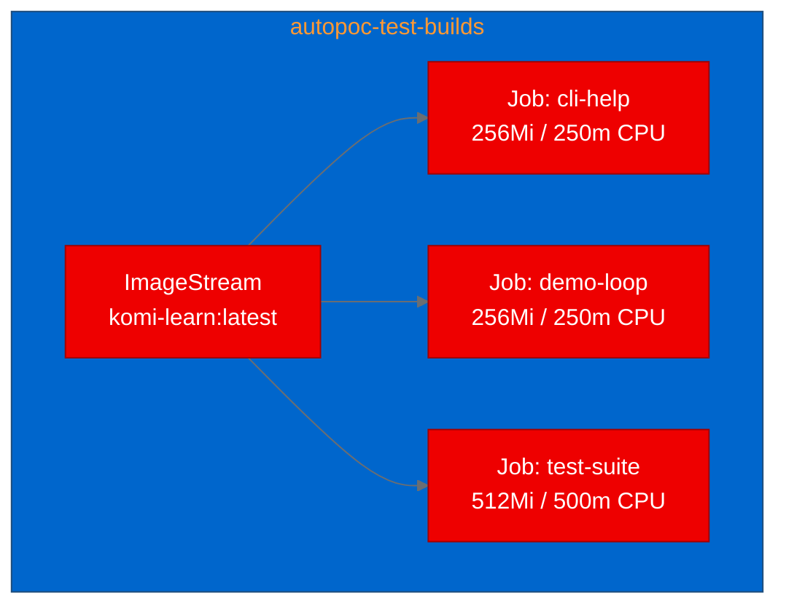

<!-- Changelog v2: Fixed formatting issues (backticks, CTA placement, Red Hat links), added deployment diagram, added hero image placeholder, added alt text to diagrams, expanded acronyms, sentence case title -->

## Containerizing komi-learn: testing AI agent memory on Red Hat OpenShift

*Want to validate your own AI tooling on OpenShift? [Start with the Red Hat OpenShift AI docs](https://docs.redhat.com/en/documentation/red_hat_openshift_ai_self-managed) or jump to the [try it yourself](#try-it-yourself) section below.*

--------------------
**[Image Placeholder 1: Hero image showing the komi-learn learning loop]**

**Placement rationale**: Sets the visual tone at the top of the post
**Image generation prompt**: A clean, modern developer illustration showing a circular learning loop with four stages (recall, distill, curate, share) on a dark background (#151515), with Red Hat brand accent colors (#EE0000 for primary elements, #F0F0F0 for labels), minimalist line art style, 16:9 aspect ratio
**Alt text**: Diagram showing the komi-learn learning loop with four stages: recall, distill, curate, and share

--------------------

AI coding agents are becoming part of the developer toolkit, but the ecosystem around them, from memory layers to skill plugins, remains largely local-first. We set out to answer a simple question: can you take a Python-based agent plugin, package it with [Red Hat Universal Base Image (UBI)](https://www.redhat.com/en/blog/introducing-red-hat-universal-base-image), and validate it on [Red Hat OpenShift](https://www.redhat.com/en/technologies/cloud-computing/openshift) as a Job workload?

The project we picked is [komi-learn](https://github.com/kurikomi-labs/komi-learn), a continuous memory and self-improvement layer for coding agents like Claude Code and Codex. It watches coding sessions, distills durable lessons (your style preferences, debugging techniques, reusable fixes), and recalls them automatically at the start of the next session. No slash commands, no manual bookmarks.

## What komi-learn does

The core loop is straightforward:

1. **Recall:** At session start, learnings relevant to the current context load automatically.
2. **Distill:** After the session, a background pass reads the transcript and extracts durable lessons.
3. **Curate:** Over time, overlapping lessons merge and stale ones archive.
4. **Share:** General lessons can optionally flow to a community pool (cryptographically signed, human-gated).


*komi-learn's four-stage learning loop running inside an OpenShift container.*

What makes it interesting for containerization is its dependency profile: the core engine has zero required dependencies. It runs entirely on Python's standard library. Optional extras (blake3 for hashing, pynacl for signing, sentence-transformers for semantic recall) layer on top without breaking the core.

## Building a UBI container

We used the UBI9 Python 3.12 base image from the [Red Hat container catalog](https://catalog.redhat.com/software/containers/ubi9/python-312/). The Dockerfile is minimal:

```dockerfile
FROM registry.access.redhat.com/ubi9/python-312

WORKDIR /opt/app-root/src
USER 0
RUN dnf install -y git && dnf clean all
COPY pyproject.toml .
COPY komi/__init__.py komi/__init__.py
RUN pip install --no-cache-dir -e ".[dev]"
COPY . .
RUN pip install --no-cache-dir -e ".[dev]"
RUN chgrp -R 0 /opt/app-root && chmod -R g=u /opt/app-root
USER 1001
ENTRYPOINT ["komi-learn"]
CMD ["--help"]
```

A few things worth noting:

- **Git is pre-installed** on UBI9 Python images, but we explicitly ensure it's available because komi-learn's pool module shells out to git for repository operations.
- **The chgrp command must run as root.** Our first build attempt failed because we switched to USER 1001 before the permission fix. OpenShift assigns random UIDs in group 0, so the chgrp line is critical for [OpenShift's security model](https://docs.redhat.com/en/documentation/openshift_container_platform/4.18/html/images/creating-images).
- **No EXPOSE directive.** This is a CLI tool, not a server. It runs as a Job, not a Deployment.

## Deploying as OpenShift Jobs

Since komi-learn is a CLI tool that runs and exits, we deployed three Kubernetes Jobs rather than Deployments:


*Deployment topology: three Jobs pulling from the internal image stream.*

Each Job ran a different test scenario: CLI help verification, the built-in demo loop, and the full pytest suite. Here's the demo-loop Job manifest:

```yaml
apiVersion: batch/v1
kind: Job
metadata:
  name: komi-learn-demo-loop
spec:
  backoffLimit: 1
  activeDeadlineSeconds: 120
  template:
    spec:
      containers:
        - name: komi-learn
          image: image-registry.openshift-image-registry.svc:5000/autopoc-test-builds/komi-learn:latest
          command: ["python"]
          args: ["examples/demo_loop.py"]
      restartPolicy: Never
```

We hit a practical issue during the build phase: Quay.io consistently rate-limited our pushes when reusing UBI base image blobs. After four failed attempts, we switched to the OpenShift internal registry, which worked on the first try. For PoC work, the internal registry is a reliable fallback when external registries throttle.

## Test results

| Scenario | Status | Duration | Details |
|----------|--------|----------|---------|
| CLI help | Pass | 5s | All 14 subcommands listed correctly |
| Demo loop | Pass | 4s | Full distill/recall/curate/pool cycle completed |
| Test suite | Fail | 309s | 153 passed, 22 skipped, 1 failed |

The demo loop result is the most interesting. It exercises the entire learning pipeline with a scripted model (no API key needed): a simulated coding session where the user corrects the agent's style, the distiller extracts three learnings, and a second session recalls them automatically. All of this ran correctly under OpenShift's security constraints with a random UID.

The single test failure in the suite is a pre-existing bug in the upstream project's pool pull logic, not a containerization issue. The 153 passing tests confirm that komi-learn's core engine, adapters, CLI, and store all work correctly in the container.

## What we learned

Zero-dependency Python packages containerize trivially. komi-learn's design choice to keep the core engine stdlib-only meant we had nothing to debug in the container: no missing system libraries, no binary wheel compatibility issues, no GPU driver mismatches.

Jobs are the right workload pattern for CLI validation. Instead of wrestling a CLI tool into a long-running Deployment (which would CrashLoopBackOff), each test scenario ran as its own Job with a clear completion status. This maps naturally to CI/CD pipelines and is a pattern worth adopting for any CLI-based AI tooling you need to validate.

OpenShift security constraints proved to be a non-issue for well-structured Python packages. The random UID assignment, non-root enforcement, and capability dropping all worked without any application code changes. The only adjustment we needed was in the Dockerfile: the chgrp command for group 0 ownership.

## Try it yourself

The full PoC artifacts are available in the [autopoc-artifacts branch](https://github.com/aicatalyst-team/komi-learn/tree/autopoc-artifacts), including the Dockerfile, Kubernetes manifests, and detailed report.

To reproduce on your own cluster:

```bash
git clone https://github.com/aicatalyst-team/komi-learn
cd komi-learn
oc new-build --name=komi-learn --binary --strategy=docker
oc start-build komi-learn --from-dir=. --follow
kubectl apply -f kubernetes/komi-learn-demo-loop-job.yaml
kubectl logs job/komi-learn-demo-loop
```

If you're building AI coding agent tooling and want to validate it on OpenShift, the Job workload pattern demonstrated here works well for any CLI tool or library with a clear test suite. Check out the [Red Hat OpenShift AI documentation](https://docs.redhat.com/en/documentation/red_hat_openshift_ai_self-managed) to learn more about deploying AI workloads on the platform.
